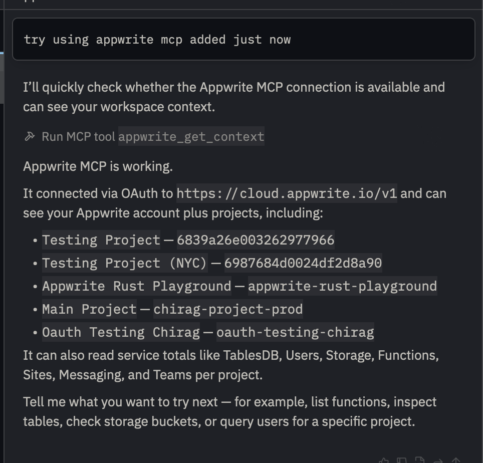
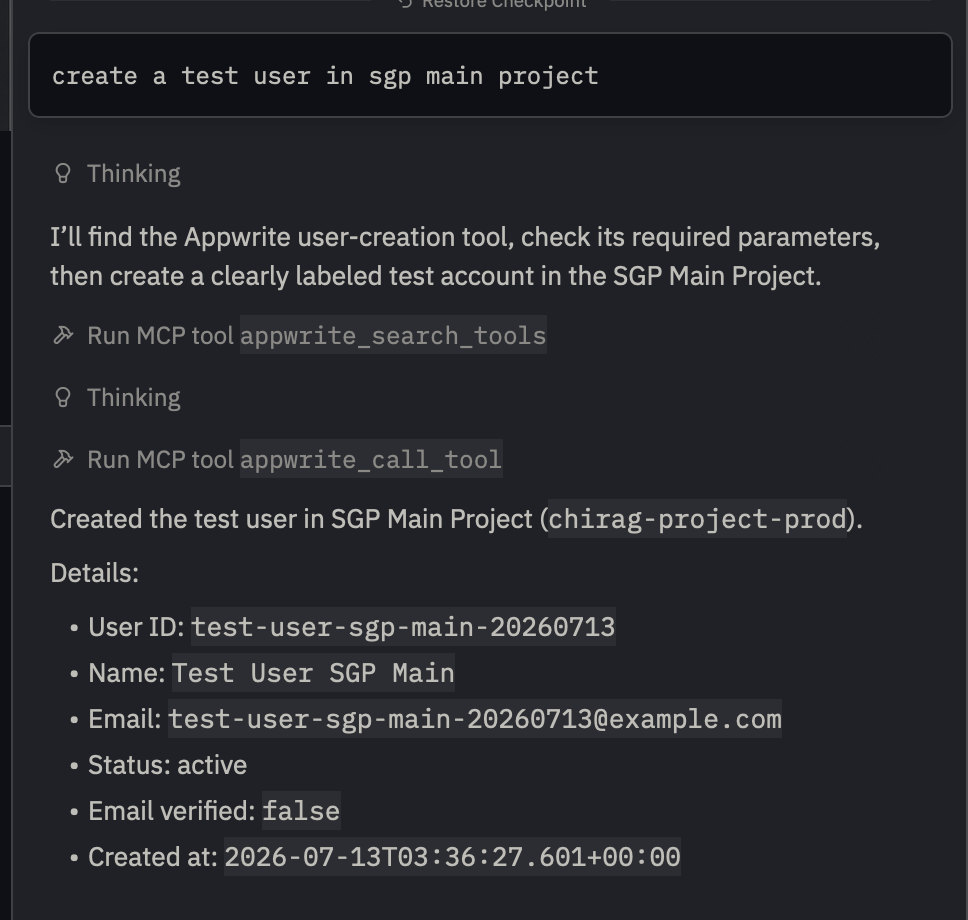

# Appwrite MCP Server for Zed

Use Appwrite's hosted MCP server from Zed to manage projects and resources with the Agent Panel. Authentication uses Appwrite's browser-based OAuth flow, so the extension does not require API keys or manually entered secrets.

## Installation

1. Open the Zed Extension Gallery with `zed: extensions` or from **Zed > Extensions**.
2. Search for **Appwrite MCP Server** and select **Install**.
3. Open **Settings > AI > MCP Servers** and enable **Appwrite MCP Server**.
4. Complete the Appwrite authentication flow in your browser.

## Enable Appwrite tools

Open the Agent Panel, select the active Agent profile, and enable the Appwrite MCP tools for that profile. You can then test the connection with:

> Use Appwrite to show my workspace context and list my projects.

Zed asks for confirmation before tool calls by default. Review and approve write operations before they run.

## Troubleshooting

### The browser did not open

Restart **Appwrite MCP Server** from **Settings > AI > MCP Servers**. If the browser still does not open, copy the authentication URL from the server output and open it manually.

### The server status is not green

Open **Settings > AI > MCP Servers** and check the status next to **Appwrite MCP Server**. Restart the server and confirm that the extension is allowed to install the `mcp-remote` npm package.

### The OAuth session needs to be refreshed

Sign out or clear the saved Appwrite MCP authorization from the server controls, restart the server, and complete the browser authentication flow again.

### Inspect logs

Run `zed: open log` from the Command Palette and search for `appwrite-mcp` or `mcp-remote`.
